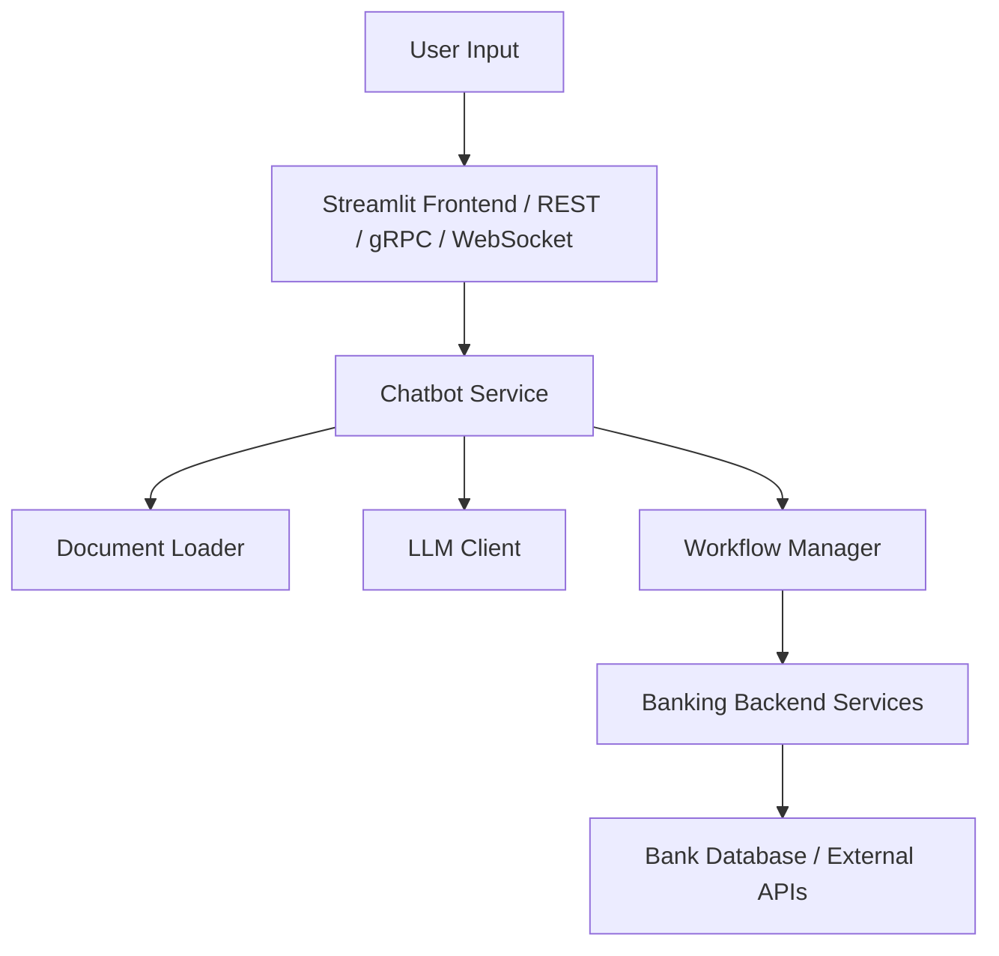

Of course! Here's a **professional and beautiful `README.md`** for your **Banking Assistant AI Chatbot**, including sections like **project overview, features, workflows, architecture, setup instructions, and examples**.

---

# 🏦 Fintria

Welcome to the **Fintria AI** project — an intelligent assistant built with **Streamlit**, **FastAPI** (REST), **gRPC**, **WebSocket**, and **Langchain**, designed to provide banking services like balance inquiries, loan checks, transaction history, and more through a conversational interface.

This chatbot is engineered with **workflow principles** for reliable, modular, and scalable interactions, mimicking real-world banking operations.

---

## ✨ Features

- **Streamlit Web UI** for live interaction.
- **REST API** integration with FastAPI.
- **gRPC API** for high-performance communication.
- **WebSocket API** for real-time messaging.
- **Document Loading** with custom `SimpleDirectoryLoader`.
- **LLM (Large Language Model)** powered by **Ollama LLM** (using models like Mistral).
- **Workflow Engine** integration for:
  - Account balance inquiry
  - Loan eligibility check
  - Transaction history retrieval
  - Payments/Transfers
  - Human agent escalation
- **Session State Management**.
- **Backend Service Abstraction** (easy to plug in real databases).
- **Easy extensibility** for future banking use cases.

---

## 📚 Architecture



- **Presentation Layer**: Streamlit frontend and APIs.
- **Service Layer**: Business logic and workflows.
- **Model Layer**: LLM integration for smart responses.
- **Persistence Layer**: (Future) Database for users, transactions, etc.

---

## 🚀 Setup Instructions

### 1. Clone the Repository

```bash
git clone https://github.com/yourusername/banking-assistant-ai.git
cd banking-assistant-ai
```

### 2. Install Requirements

```bash
pip install -r requirements.txt
```

Make sure you have **Python 3.11+** installed.

---

### 3. Running Servers

| Server Type | Command | Description |
| :---------- | :------ | :----------- |
| Streamlit UI | `streamlit run src/app/streamlit_app.py` | Interactive chatbot frontend |
| REST API | `python src/app/rest_api.py` | FastAPI-based REST server |
| gRPC Server | `python src/app/grpc_server.py` | gRPC server for efficient communication |
| WebSocket Server | `python src/app/websocket_server.py` | Real-time WebSocket server |

---

### 4. Folder Structure

```plaintext
src/
  app/
    streamlit_app.py         # Streamlit Frontend
    rest_api.py               # REST API
    grpc_server.py            # gRPC Server
    websocket_server.py       # WebSocket Server
    proto/                    # Protobuf definitions
  core/
    services/
      simple_directory_loader.py
      ollama_llm_client.py
      banking_chatbot_service.py
      backend_service.py      # Abstract banking operations
tests/
  functional/
    test_rest_api.py
    test_grpc_api.py
    test_websocket_api.py
docs/                         # Preloaded documents for chatbot
```

---

## 🛠️ Workflows Overview

| Workflow | Description | Entry Point |
| :------- | :----------- | :----------- |
| Account Balance Inquiry | Get your account balance securely | "check balance" |
| Loan Eligibility Check | See if you're eligible for loans | "check loan eligibility" |
| Transaction History Retrieval | View recent transactions | "view transactions" |
| Payments/Transfers | Send money securely | "make payment" |
| Escalate to Agent | Talk to a human support agent | "escalate issue" |

---

## 📦 Example API Requests

### REST Example (using `curl`)

```bash
curl -X POST http://localhost:8000/chat \
  -H "Content-Type: application/json" \
  -d '{"message": "What is my account balance?"}'
```

---

### gRPC Example (Python Client)

```python
import grpc
import src.app.proto.chat_pb2 as chat_pb2
import src.app.proto.chat_pb2_grpc as chat_pb2_grpc

channel = grpc.insecure_channel('localhost:50051')
stub = chat_pb2_grpc.ChatServiceStub(channel)
request = chat_pb2.ChatRequest(user_message="Tell me about loans")
response = stub.Chat(request)
print(response.bot_message)
```

---

### WebSocket Example (Python)

```python
import websocket
import json

def on_message(ws, message):
    print("Received:", message)

ws = websocket.WebSocketApp("ws://localhost:8001/chat", on_message=on_message)
ws.run_forever()
```

---

## 🧠 Future Improvements

- Integrate with real banking backend (databases/APIs)
- Add user authentication (OAuth, JWT)
- Fine-tune LLM for banking-specific knowledge
- Rich chat UI with Streamlit Components
- Alert systems for suspicious activities

---
## 📽️ Live Demo
[🎥 Watch Demo Video](media/demo.mp4)
> 💡 Smart Conversations | 🏦 Banking Knowledge | 🔥 Built with LLMs, Workflows, and FinTech APIs


## 📜 License

This project is licensed under the MIT License.  
Feel free to modify and extend it!

---

## 🤝 Contributions

Contributions are welcome!  
Please open issues and pull requests to improve workflows, models, or APIs.

---